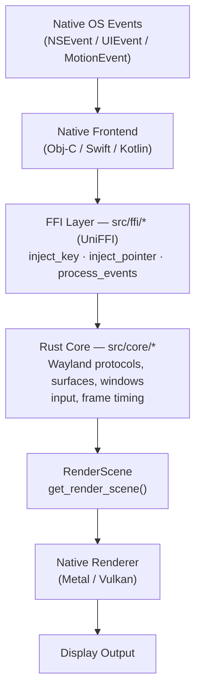
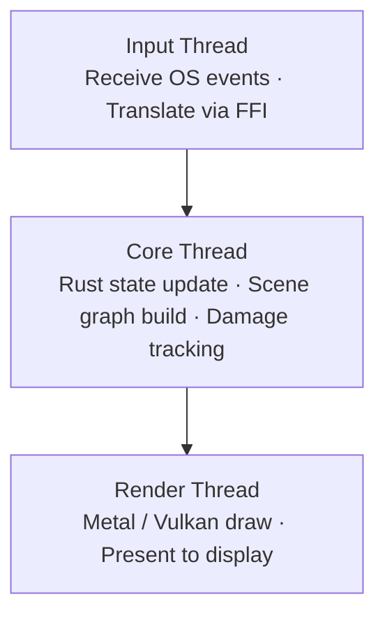

+++
title = "Architecture"
date = 2026-02-22
weight = 2
+++

# Architecture

Wawona is a **Rust-first, cross-platform Wayland compositor**. All compositor logic lives in Rust. Platform frontends are thin native adapters written in Objective-C/Swift (macOS/iOS) and Kotlin/JNI (Android).

---

## Design Philosophy

- **Core**: All shared logic is OS-agnostic and fully testable in isolation
- **Platform**: Thin adapters translate native events and render buffers via Metal/Vulkan
- **FFI**: UniFFI boundary ensures safe memory and threading — no Wayland types leak across
- **Protocol modules**: Each protocol owns its state and handler logic
- **Rendering**: Native GPU APIs consume a `RenderScene` produced by the Rust core

---

## High-Level Flow



---

## Source Layout

```
src/
├── lib.rs                  # Crate root, UniFFI scaffolding
├── main.rs                 # CLI entry point
│
├── core/                   # Platform-agnostic compositor logic
│   ├── compositor.rs       # Lifecycle, Wayland display, client connections
│   ├── runtime.rs          # Event loop, frame timing, task scheduling
│   ├── socket_manager.rs   # Wayland socket management
│   ├── ipc.rs              # Inter-process communication
│   ├── surface/            # Surface & buffer lifecycle
│   ├── window/             # Window management, z-order, focus
│   ├── wayland/            # All protocol implementations
│   ├── input/              # Input event types
│   ├── render/             # Render scene generation
│   └── time/               # Frame timing
│
├── ffi/                    # FFI boundary (UniFFI + C API)
│   ├── api.rs              # WawonaCore — main FFI object
│   ├── types.rs            # FFI-safe structs and enums
│   ├── c_api.rs            # C-compatible API wrappers
│   ├── callbacks.rs        # Platform callback traits
│   └── errors.rs           # FFI error mapping
│
├── platform/               # Platform trait definitions
│   └── api.rs              # Platform trait + StubPlatform
│
├── rendering/              # Native rendering code
│   ├── metal_shaders.metal # Metal shaders (Apple)
│   ├── renderer_apple.m    # Metal renderer (macOS/iOS)
│   └── renderer_android.c  # Vulkan renderer (Android)
│
└── input/                  # Native input handling
    ├── input_handler.m     # macOS/iOS input (NSEvent → Wayland)
    └── wayland_seat.c      # Seat implementation
```

---

## Platform Frontends

| Platform | Language | Rendering | Window System |
|----------|----------|-----------|---------------|
| **macOS** | Objective-C + Swift | Metal (CAMetalLayer) | AppKit (NSWindow) |
| **iOS** | Objective-C + Swift | Metal (CAMetalLayer) | UIKit (UIWindow) |
| **Android** | Kotlin + JNI + C | Vulkan | SurfaceView |

Each frontend:
1. **Captures** native OS events (touch, keyboard, mouse)
2. **Translates** them to Wayland-compatible input via FFI (`inject_key`, `inject_pointer_motion`, etc.)
3. **Calls** `process_events()` to advance the compositor state
4. **Retrieves** a `RenderScene` via `get_render_scene()`
5. **Renders** each scene node using the native GPU API

---

## Wayland Protocol Support

Wawona registers **68 protocol globals** at startup, organized by category:

| Category | Protocols | Examples |
|----------|-----------|---------|
| **Core** (6) | Fundamental Wayland | `wl_compositor`, `wl_shm`, `wl_seat`, `wl_output` |
| **XDG** (9) | Desktop shell | `xdg_wm_base`, `xdg_decoration`, `xdg_output` |
| **wlroots** (10) | Compositor extensions | `layer_shell`, `screencopy`, `foreign_toplevel` |
| **Buffer & Sync** (5) | GPU sharing | `linux_dmabuf`, `explicit_sync`, `drm_syncobj` |
| **Input** (10) | Advanced input | `pointer_constraints`, `text_input`, `tablet` |
| **Timing** (8) | Frame control | `presentation_time`, `fractional_scale`, `fifo` |
| **Session** (5) | Security | `session_lock`, `idle_inhibit`, `security_context` |
| **Desktop** (4) | Integration | `foreign_toplevel_list`, `workspace` |
| **Capture** (4) | Screen capture | `image_copy_capture`, `xwayland_shell` |
| **Plasma** (7) | KDE protocols | `kde_decoration`, `blur`, `contrast` |

For detailed implementation status per protocol, see [Protocols](/docs/protocols/).

---

## Rendering Pipeline

### Apple (macOS / iOS) — Metal

1. Client writes pixel data to a shared buffer
2. Wawona wraps it in an `IOSurface` (zero-copy GPU access)
3. Metal renderer reads directly from the `IOSurface`
4. Composited via custom Metal shaders (MSL)
5. Synchronized with display via `CVDisplayLink` (macOS) / `CADisplayLink` (iOS)

### Android — Vulkan

1. Client submits SHM buffers over the Wayland protocol
2. Buffer data uploaded to `VkImage`
3. Rendered as textured quads via SPIR-V shaders
4. Presented through Android's `SurfaceView`
5. Synchronized with `Choreographer` frame callbacks

---

## Threading Model



---

## Build System

Wawona uses **Nix** as the single build system for all platforms:

| Platform | Strategy | Command |
|----------|----------|---------|
| macOS | Pure Nix build | `nix run` |
| iOS | Nix + XcodeGen | `nix run .#wawona-ios` |
| Android | Nix + GradleGen | `nix run .#wawona-android` |

The Rust backend is compiled via **crate2nix**, which generates per-crate Nix derivations for incremental caching. See [Compilation Reference](/docs/compilation/) for details.

---

## Next Steps

- [Getting Started](/docs/getting-started/) — build and run Wawona
- [macOS Implementation](/docs/macos/) — deep dive into the Metal rendering pipeline
- [Protocols](/docs/protocols/) — detailed protocol implementation status
- [Nix Build System](/docs/nix-build-system/) — how the build pipeline works
